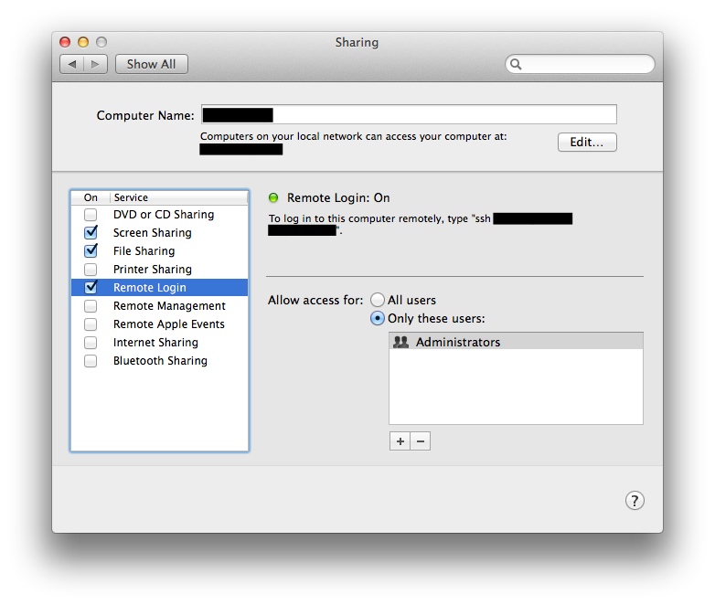

# Shutdown for iOS
## Guide
With `Shutdown` you are able to shutdown your Computer with just the touch of a button! The app is kind of a GUI to the `shutdown`-command by the use of ssh.  
###Installation
#### Mac OS X
In order to use `Shutdown` with a Mac, just enable the `Remote Login` sharing option in your system preferences.   The username and password to login from the app depend on your selection on `Allow access for`. Under Mac OS X you can choose a different command to shutdown, which does not require administraive permission! But if you want to use the kind of a "hard" shutdown (e.g. `shutdown -h 0`), your selected user have to be an admin.

####Linux
Linux was just barely tested by me. But as Linux is also based on UNIX, you can use the app like on Mac OS X. Therefore you have to enable ssh with a admintrative user.

####Windows
The use of this app with Windows is tricky. As I know, a required function is not preinstalled! If you want to use Windows, please contact me on Twitter or via Email. Let's see, what we can do!
